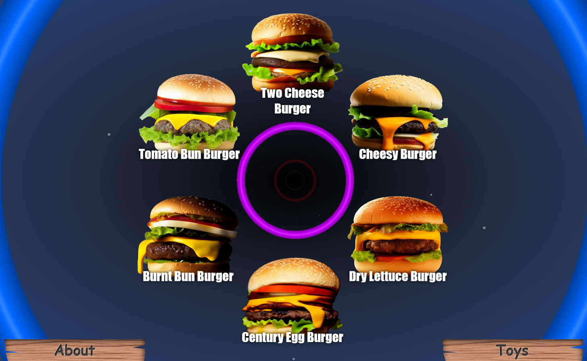
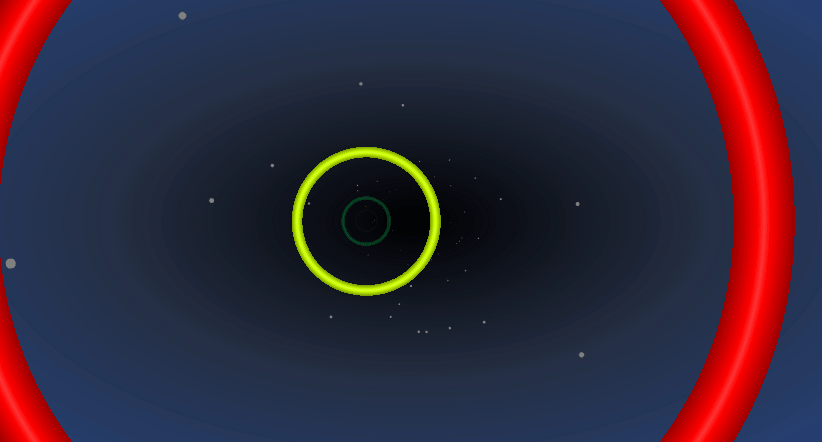

# odin-restaurant-page

# Live: https://hectorvilas.github.io/odin-restaurant-page/

## Description
Welcome to this new practice! It's not really new, I'm writing this after finishing with it. This is a page for an imaginary fast food restaurant, made for kids (or at least that's what I had in mind).

This practice required Webpack and writing everything on `JavaScript` and `CSS`, nothing in the `HTML`s `<body>` except for a `div#content`. It also required nodes.

I had problems setting up the Webpack, but managed to set up something basic with it. I'm still confused about some things about it, but I'm guessing that from now on all the practices will require Webpack, so I'll have a chance to learn more in the future.

First I disliked Webpack, it took me out from my comfort zone as some things required extra work (setting things up, a new branch for the GitHub live, desync with the nodes compilation for the *dist* folder and the Visual Studio's Live plugin, etc), but now I understand why this is important. I still prefer the old way, but I'm guessing this will be needed for frameworks and other things.

## The content
The page is pretty simple: 3 modules for the different sections of the restaurant. The practice was just that, but I wanted something a little more complex, but ended with whatever this page is.
The images had been generated with Stable Diffusion, using [AUTOMATIC1111's WebUI](https://github.com/AUTOMATIC1111/stable-diffusion-webui). All the work for the images was done by the AI, I just had to remove the background with Gimp.

## The page

For the navigation I added two signs for the 3 pages. Those clickable signs will go to the next or previous page. I decided that the current page won't need a button if the user is already on it, at least for this practice.

For the background, I made this with CSS and some divs. I didn't had a clear idea of what I wanted, so I made this tunnel effect with colored rings and a starfield, just to have dynamic aesthetics.

## Menu section

For the food menu, the items are placed in a circular way. An animation will play when the user gets to this part of the page. Each item have an image and it's name. The items have a `:hover` effect that will make them 110% bigger and add a glowing outline effect. Clicking on it does nothing, it's just a detail.

## Toys section

For this section I generated with Stable Diffusion some off-brand looking toys and plushies, parodying the Happy Meal from McDonald.

For the presentation I created some kind of carousel. I don't know if this qualify as one. There's a div with all the toys distributed around it. The Next/Previous buttons will add or substract 36° on it. This "wheel" is displaced to the bottom, leaving the toy image where it should be. The parent have an `overflow: hidden` property to hide the wheel.

## About section

Finally there's the About section. This contains an `<iframe>` with a location on Google Maps (I chose the north atlantic ocean as a joke) and a hand that will "fly around" and land in the map marker, bouncing on it. The map can be interacted, but there's no point on doing this.

I drew the hand on InkScape, it's the same hand from the signs and the carousel, but I moved each layer to different images. The bouncing, swaying and other animations has been done with pure `CSS`.

The bouncing hand have 3 animations: one for swaying, one for bouncing and one for vertical scaling, plus the fly around.

I wanted to use `offset-path` for the fly thru, but even getting the values from custom drawn lines on InkScape, it never behaved as I wanted. The rotation was very off, and I wanetd the "front" to be the index finger. The only property to fix that was still experimental and had no compatibility with lots of browsers, and a manual fix was a waste of time considering how I can't manage to make use of the `offset-path`. My solution was animating the transform-origin with the rotation, It's not the same, but at least it works.

To make the hand look more dynamic, each layer have a little delay. Now instead of looking like a simple image, each finger will move individually.

# Final thoughts
I didn't planed anything ahead. I just had an idea and that was all. Not the best approach for a project, but at least I've been experimenting a lot with `CSS`, and that's why there's lots of animations in the entire page.

I hope I get a better grip of Webpack for my next project, because the plugins are something I could take advantage, and it feels like this is the way it's done in a real job.

It's time to move on, the next lesson from The Odin Project is about good practices for `JavaScript`, the best ways to work with the code (Like the Singe Responsability thing, so reading the code will be way much easier and refactoring will require less work). See you in my next project!